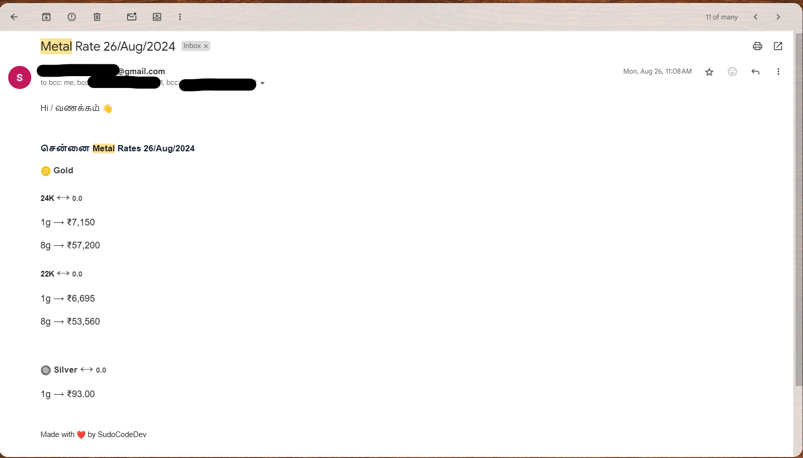
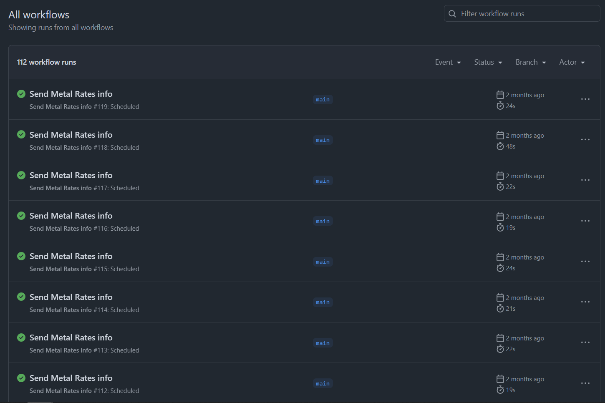

# Gold Rate Notifier

A Python project that scrapes gold rates based on carats in Chennai and sends daily email updates to users.

## Features

- Scrapes gold rates using Beautiful Soup
- Sends daily email notifications with current gold rates
- Configurable email settings using GitHub Secrets and Environment Variables
- Automated script execution with GitHub Actions

## Requirements

- Python 3.x
- Beautiful Soup 4
- Requests
- smtplib (included in Python's standard library)

## 🖼️ Screenshots

*Email sent with gold rate in chennai*

*workflows in github actions for sending gold rates*
